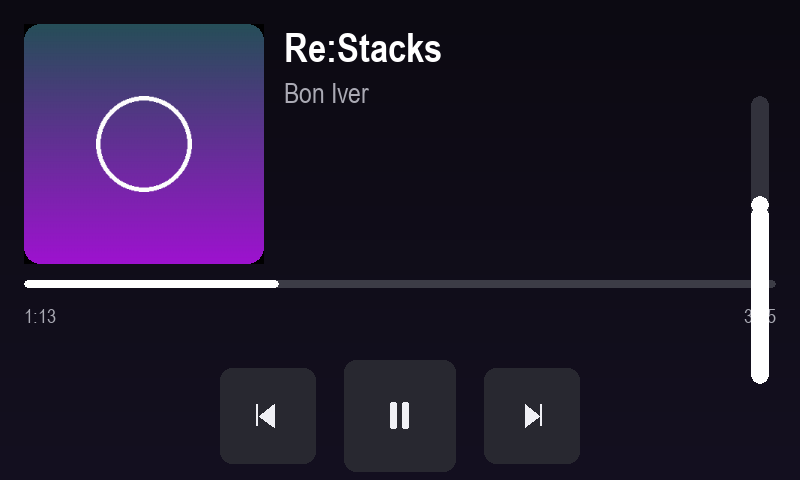

# pi-nowplaying

Afficheur **« Now Playing »** pour Raspberry Pi 3A+ (moOde / Debian 13) piloté
en framebuffer KMSDRM sur un écran tactile DSI 800×480. Source audio AirPlay
(shairport-sync) **ou** Bluetooth (A2DP), avec horloge/météo en veille.

Ce dépôt regroupe le moteur d'interface, l'application, les scripts système de
durcissement et le pipeline de déploiement — soit les **4 chantiers** ci-dessous.



> *Rendu réel de `app/views/nowplaying_view.py` composé par le moteur (cover,
> titre/artiste, barre de progression, transport, fader de volume) — généré
> en headless via `tests/render_demo.py`.*

---

## Arborescence

```
pi-nowplaying/
├── app/
│   ├── nowplaying.py        # application en production (stable, procédurale)
│   ├── npconfig.py          # configuration (géométrie, palette, météo…)
│   ├── npstate.py           # état thread-safe partagé
│   ├── btvolume.py          # CHANTIER 1.4 — volume BT correct (AVRCP/bluez-alsa)
│   ├── ui/                  # CHANTIER 1 — moteur UI retained-mode
│   │   ├── core.py          #   Widget, Container, compositeur dirty-rect, easing
│   │   ├── layout.py        #   VBox / HBox / ZStack / Spacer
│   │   └── widgets.py       #   Label, Icon, Button, ProgressBar, VolumeFader
│   └── views/
│       └── nowplaying_view.py   # écran d'exemple assemblé avec le moteur
├── scripts/
│   ├── bluealsa-codecs.sh   # CHANTIER 2 — recompiler bluez-alsa (AAC/aptX/LDAC)
│   └── overlayfs-setup.sh   # CHANTIER 3 — racine read-only + tmpfs (anti-corruption)
├── system/                  # unités systemd + setmode.sh (arbitrage AirPlay/BT)
├── tests/
│   ├── test_ui.py           # 18 tests sans matériel (moteur + btvolume)
│   └── render_demo.py       # génère docs/preview.png
├── docs/ARCHITECTURE.md     # référence complète du matériel + système
└── .github/workflows/deploy.yml   # CHANTIER 4 — CI/CD push→main = déploiement
```

---

## CHANTIER 1 — Moteur UI orienté objet (retained-mode)

Remplace la boucle procédurale immédiate par un **scene graph** où chaque widget
ne re-render que ses propres pixels quand ses données changent.

- **`Widget`** (`ui/core.py`) : `rect` + cache pixel (`pygame.Surface`) + drapeau
  `is_dirty`. `render_cache()` ne repeint que si `is_dirty` ; sinon c'est un
  simple blit. L'invalidation se fait uniquement dans les setters
  (`set_text`, `set_value`, `set_color`…) — **jamais par frame**.
- **Layout** (`ui/layout.py`) : `VBox` / `HBox` positionnent automatiquement les
  enfants (axe principal + alignement transverse), `Spacer` absorbe l'espace
  restant (flex). **Aucune coordonnée d'enfant codée en dur** dans les vues.
- **Routage des événements** : propagation descendante depuis la racine
  (`Container.handle_event` → enfants du plus haut au plus bas), chaque widget
  testant `collidepoint`. Un `Button` consomme le DOWN qui le touche et ne
  déclenche `on_press` que si le UP retombe dessus (annulation au glissé-dehors).
- **Compositeur dirty-rectangle** (`WindowManager`) : ne repeint que les régions
  endommagées puis `display.update(rects)`. Un tic d'horloge en veille = un
  repaint de ~300×140 px, pas tout l'écran.
- **CHANTIER 1.4 — volume Bluetooth** (`btvolume.py`) : l'ancien code faisait
  `amixer -c Headphones sset PCM` sur **la carte muette** (le son sort en HDMI
  vers le DAC externe ; le jack PWM est bypassé → réglage inaudible). Le fader
  est désormais mappé sur le **volume absolu AVRCP** via BlueZ
  `MediaTransport1.Volume` (0–127, qui synchronise l'UI volume de l'iPhone),
  avec repli **soft-volume bluez-alsa** (`bluealsactl`).

### Tester / voir

```bash
cd pi-nowplaying
SDL_VIDEODRIVER=dummy SDL_AUDIODRIVER=dummy python3 tests/test_ui.py      # 18/18
SDL_VIDEODRIVER=dummy SDL_AUDIODRIVER=dummy python3 tests/render_demo.py  # -> docs/preview.png
```

### Brancher le volume BT dans l'app

Dans `app/nowplaying.py`, remplacer le corps de `set_bt_volume(pct)` par :

```python
import btvolume
def set_bt_volume(pct):
    if btvolume.set_bt_volume(pct, log=log):   # AVRCP absolu, repli bluez-alsa
        state.set(volume=max(0, min(100, int(pct))))
```

---

## CHANTIER 2 — Codecs Bluetooth (SBC → AAC / aptX / LDAC)

`scripts/bluealsa-codecs.sh` recompile **bluez-alsa** avec les codecs activés.
L'unité est un **sink A2DP** alimenté par un iPhone, qui émet en **AAC** : c'est
le gain réel ici (SBC est le goulot par défaut). aptX/LDAC ne servent qu'à une
source Android et sont désactivés par défaut (encodeurs non packagés partout).

```bash
# sur la Pi, avec sudo (PAS depuis la CI)
sudo ./scripts/bluealsa-codecs.sh                       # AAC (recommandé)
sudo BUILD_LDAC=1 BUILD_APTX=1 ./scripts/bluealsa-codecs.sh   # tout
```

Installe le daemon recompilé dans `/usr/local`, le branche via un **drop-in**
systemd sur `bt-bluealsa.service` (l'original reste intact → rollback trivial),
puis vérifie. Réf. dépendances Debian 13 (libfdk-aac, libldacbt-enc…) et
rollback dans l'en-tête du script.

---

## CHANTIER 3 — Résilience OS (racine read-only / OverlayFS)

`scripts/overlayfs-setup.sh` rend `/` **read-only** avec un overlay **tmpfs**
(RAM) : toute écriture part en RAM et est jetée au reboot → une coupure de
courant ne peut plus corrompre la carte SD.

- Exceptions montées en RAM : `/run`, `/tmp` (déjà tmpfs — `/run/nowplaying-mode`
  et son `.lock` y vivent), plus `/var/log` et `/var/tmp` en tmpfs **plafonné**.
- journald en `Storage=volatile` (zéro usure SD, aucune écriture vers un
  `/var/log` read-only).
- Helper `fsprotect on|off|status` installé pour la maintenance / le déploiement.

```bash
sudo ./scripts/overlayfs-setup.sh && sudo reboot
findmnt /            # FSTYPE = overlay
fsprotect status     # overlay: ON (root read-only)
```

> ⚠️ **Interaction CI/CD** : une racine read-only fait échouer `rsync`. Le
> workflow CHANTIER 4 gère cela (variable `OVERLAY_MANAGED=true` → `fsprotect
> off`, deploy, `fsprotect on`). En manuel : `sudo fsprotect off && sudo reboot`.

---

## CHANTIER 4 — CI/CD (déploiement automatisé)

`.github/workflows/deploy.yml` : sur chaque *push* `main` touchant `app/**`,
déploie sur la Pi par SSH et redémarre le service — en gardant la règle d'or
(**ne jamais crasher l'écran**) : `py_compile` + smoke-test import headless +
backup taggé **avant** de toucher le fichier live, puis vérification de santé.

Étapes : checkout → **Tailscale** (le runner cloud ne peut pas joindre une IP
LAN `192.168.x.x`) → clé SSH + `known_hosts` épinglé → rsync vers `/tmp/np_stage`
→ compile/smoke → backup + install + `systemctl restart nowplaying` → vérif
`is-active` + scan journal (échec du job si erreur).

**Secrets requis** (Settings → Secrets and variables → Actions) :
`SSH_PRIVATE_KEY`, `SSH_KNOWN_HOSTS`, `PI_HOST`, `PI_USER`,
`TS_OAUTH_CLIENT_ID`, `TS_OAUTH_SECRET`. Détails et alternative *self-hosted
runner* en tête du fichier `.yml`.

---

## Matériel & système

Voir **[docs/ARCHITECTURE.md](docs/ARCHITECTURE.md)** : chaîne audio bit-perfect
HDMI→DAC, forçage EDID, arbitrage AirPlay⊕Bluetooth (`setmode.sh`),
watchdog WiFi, durcissement moOde, et la carte complète des fichiers.

## État

| Élément | État |
|---|---|
| Moteur UI + widgets + btvolume + vue démo | ✅ livré, **18/18 tests** |
| Migration de l'app legacy sur le moteur | 🔜 incrémentale (moteur prêt) |
| Script codecs bluez-alsa | ✅ livré (à exécuter sur la Pi) |
| Script overlay read-only | ✅ livré (à exécuter sur la Pi) |
| Workflow CI/CD | ✅ livré (activer : secrets + Tailscale) |
